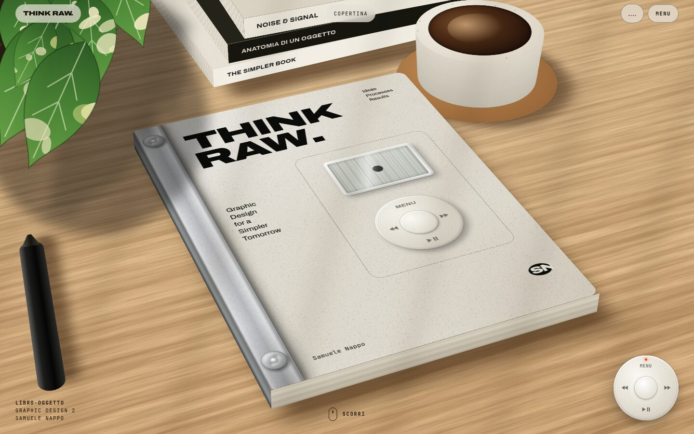
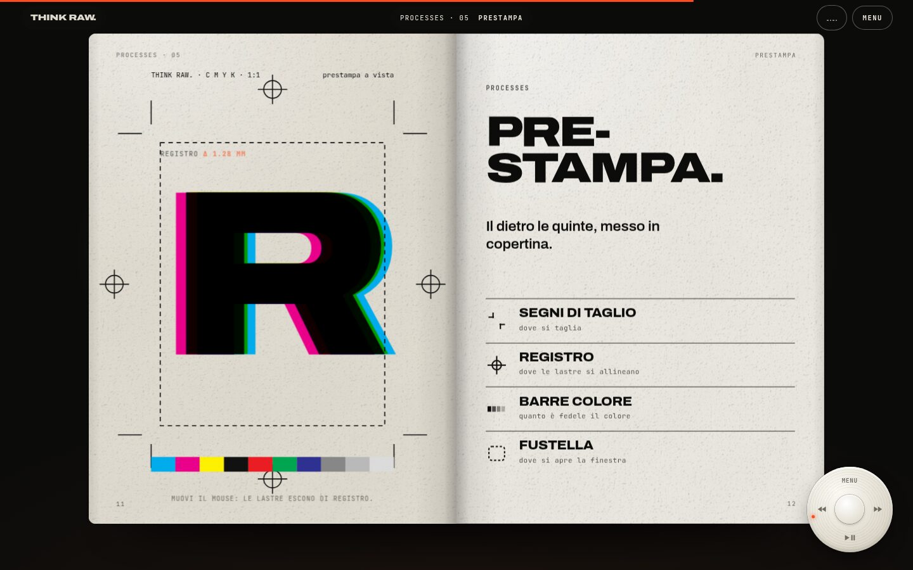
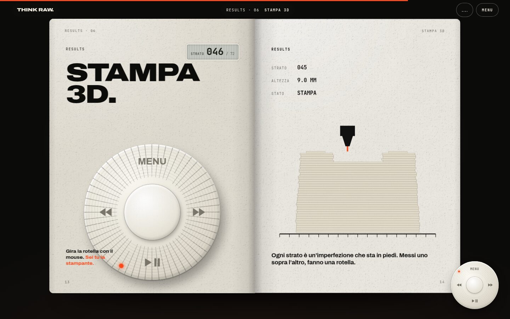

<div align="center">

# THINK RAW.

**Graphic Design for a Simpler Tomorrow** — di Samuele Nappo

Un libro-oggetto che smonta la perfezione. Qui si sfoglia scrollando.

<a href="https://cammo22.github.io/DaProdxThinkRAW/"></a>

<sub>[cammo22.github.io/DaProdxThinkRAW](https://cammo22.github.io/DaProdxThinkRAW/)</sub>



</div>

---

## Cos'è

*THINK RAW.* è un libro-oggetto di Graphic Design 2. Parte dall'iPod Classic come metafora visiva per passare da un'estetica digitale, industriale e patinata a un progetto libero, materico e d'autore: carte speciali, sovrapposizioni, dettagli di prestampa, inserti in stampa 3D. Il libro è diviso in tre parti: **Ideas · Processes · Results**.

Questo sito è il libro, ma sul web.

## Cosa succede scorrendo

1. **Il tavolo.** La scrivania con il libro in 3D (legno, luce delle foglie, tazza, penna). Scendendo, la telecamera si raddrizza, spuntano le didascalie (carta, acciaio, acrilico, stampa 3D) e infine entra *dentro* lo schermo d'acrilico.
2. **Lo schermo.** Il menu da iPod (Ideas / Processes / Results), poi il manifesto che si accende parola per parola. Alla fine lo schermo si spegne come una vecchia TV.
3. **Il libro.** Si apre e si sfoglia foglio per foglio, con le pagine che si muovono:
   - *Perfetto*: quaranta oggetti identici che si sgretolano
   - *Produzione di massa*: un nastro di esemplari, uno solo è diverso
   - *Smontare*: la vista esplosa dell'oggetto
   - *Carte speciali*: fogli da trascinare e sovrapporre
   - *Prestampa*: segni di taglio, registro, barre colore e lastre CMYK che si spostano
   - *Stampa 3D*: la rotella si gira davvero e l'inserto si costruisce strato per strato
   - *RAW.*: la parola che si sporca seguendo il mouse
4. **Il finale.** Bordo strappato, scritte che scorrono, la foto dell'oggetto.

<div align="center">
 
</div>

## Come si naviga

- **Scroll** (rotella del mouse, dito, tastiera).
- **La rotella in basso a destra** è quella dell'iPod: trascinala in cerchio per scorrere, i tasti fanno MENU / indietro / avanti / scorrimento automatico.
- **Tastiera:** `M` menu · `←` `→` pagina precedente/successiva · `Esc` chiude · `Home` / `End`.
- **Suono** sintetizzato al volo (clic della rotella, carta che gira). All'ingresso si sceglie se accenderlo.
- Sul telefono si vede una pagina alla volta.

## Come è fatto

Sito statico: HTML, CSS e JavaScript a moduli, **nessuna libreria e nessuna compilazione**. Caratteri (Archivo, JetBrains Mono, licenza OFL) e texture sono nel repo, quindi funziona anche senza rete esterna.

```
index.html
assets/
  css/        base · copertina · hero · manifesto · libro · pagine · finale
  js/
    core.js        scorrimento ammorbidito, progressi delle sezioni, attrezzi
    hero.js        la scena 3D e la telecamera
    manifesto.js   lo schermo da iPod
    libro.js       il motore che sfoglia (fogli, ombre, spessore)
    content.js     ← l'elenco delle pagine (qui si cambia il libro)
    pagine/        un file per ogni tipo di pagina animata
    nav.js · audio.js · boot.js · cursore.js · finale.js
  img/ fonts/ readme/
tools/make-textures.mjs   rigenera le texture (legno, carta, acciaio)
```

### Provarlo in locale

```bash
python3 -m http.server 8000
# poi apri http://localhost:8000
```

Con `?subito` si salta l'accensione.

### Aggiungere o cambiare pagine

Il libro è una lista di *spread* (doppie pagine) in `assets/js/content.js`. Ogni lato indica un tipo di pagina registrato in `assets/js/pagine/index.js`. Un tipo di pagina è un piccolo oggetto `{ crea(contenitore), update(loc, S, hold) }`: `loc` va da 0 a 1 mentre la pagina si apre, `hold` mentre la si legge. Le misure delle pagine sono in `cqw` (1% della larghezza della pagina), così si adattano da sole.

> I testi nelle pagine sono **provvisori**: servono a mostrare come funziona. I contenuti veri del libro si mettono in `content.js` e in `pagine/`.

## Pubblicazione

Il workflow `.github/workflows/pages.yml` copia il sito sul ramo `gh-pages` a ogni push su `main`. Se Pages non si accende da solo: **Settings → Pages → Build and deployment → Deploy from a branch → `gh-pages` / (root)**.
